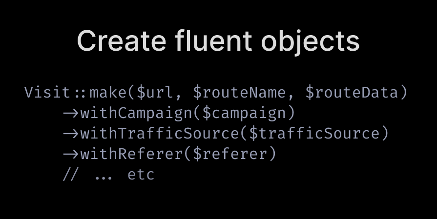

# guide-technique

## Introduction

Objectifs du livret : Ce livret a pour but d'introduire les nouveaux développeurs au monde du développement logiciel en mettant l'accent sur les bonnes pratiques, les principes fondamentaux et les outils essentiels à connaître. Nous explorerons divers concepts et techniques indispensables pour écrire un code propre, maintenable et de qualité.

## Importance des bonnes pratiques
Les bonnes pratiques en développement logiciel sont cruciales pour garantir la qualité du code, faciliter la collaboration au sein de l'équipe de développement et assurer la pérennité du projet. En adoptant ces pratiques dès le début de votre carrière de développeur, vous vous positionnez sur la voie du succès et de l'excellence technique.

## Chapitre 1 : Clean code 
"Clean code" fait référence à un style de programmation qui met l'accent sur la lisibilité, la simplicité et la maintenabilité du code source. L'idée principale est que le code doit être facile à comprendre pour les développeurs qui le lisent, ce qui facilite sa maintenance et sa collaboration.

Martin Fowler, un éminent expert en développement logiciel, a abordé ce sujet dans plusieurs de ses ouvrages et articles. Il dit : "N’importe qui peut écrire un code qu’un ordinateur peut comprendre. Les bons développeurs écrivent du code que les humains peuvent comprendre." Il souligne l'importance de la clarté du code pour qu'il soit compréhensible par les autres développeurs et pour faciliter les modifications ultérieures. Il insiste sur le fait que le code propre doit être facile à lire et que les noms des variables, des fonctions et des classes doivent être explicites et descriptifs.

Uncle Bob, ou Robert C. Martin, est un autre expert en développement logiciel bien connu pour son travail sur les bonnes pratiques de programmation. Il a écrit plusieurs livres, dont "Clean Code: A Handbook of Agile Software Craftsmanship", qui est une référence majeure dans ce domaine. Dans son livre, Uncle Bob met l'accent sur des principes tels que la réduction de la complexité, la séparation des responsabilités et le respect des conventions de codage. Il encourage également l'utilisation de tests automatisés pour garantir la qualité du code.

En résumé, Martin Fowler et Uncle Bob partagent l'idée que le code propre est essentiel pour développer des logiciels de qualité, et ils proposent des principes et des techniques pour y parvenir. Cela inclut l'écriture de code lisible, la réduction de la complexité, la séparation des préoccupations et l'utilisation de tests automatisés.

Voici un résumé des règles et conseils à suivre, avec des exemples juste en dessous.

### Règles générales
1. Suivre les conventions standards.
2. Simplifiez. Plus simple est toujours mieux. Réduisez la complexité autant que possible.
3. Laissez le bout de code sur lequel vous intervenez plus propre que vous ne l'avez trouvé.
4. Trouvez toujours la cause racine du problème et n'effectuez pas de bricolage ou de corrections temporaires.

### Règles de conception
1. Gardez les données configurables à des niveaux élevés.
2. Préférez le polymorphisme aux structures conditionnelles (if/else ou switch/case).
3. Séparez le code multi-threading.
4. Évitez la sur-configurabilité.
5. Utilisez l'injection de dépendances.
6. Suivez la loi de Demeter. Une classe ne devrait connaître que ses dépendances directes.

### Conseils de compréhensibilité
1. Soyez cohérent. Si vous faites quelque chose d'une certaine manière, faites toutes les choses similaires de la même manière.
2. Utilisez des variables explicatives.
3. Encapsulez les conditions aux limites. Les conditions aux limites sont difficiles à suivre. Mettez leur traitement à un seul endroit.
4. Préférez les objets de valeur dédiés aux types primitifs.
5. Évitez les dépendances logiques. Ne créez pas de méthodes qui fonctionnent correctement en fonction de quelque chose d'autre dans la même classe.
6. Évitez les conditionnels négatifs.

### Règles de nommage
1. Choisissez des noms descriptifs et non ambigus.
2. Faites des distinctions significatives.
3. Utilisez des noms prononçables.
4. Utilisez des noms recherchables.
5. Remplacez les nombres magiques par des constantes nommées.
6. Évitez les encodages. N'ajoutez pas de préfixes ou d'informations de type.

### Règles de fonctions
1. Petites.
2. Ne faites qu'une seule chose.
3. Utilisez des noms descriptifs.
4. Préférez moins d'arguments.
5. N'ont pas d'effets secondaires.
6. N'utilisez pas d'arguments de drapeau. Divisez la méthode en plusieurs méthodes indépendantes pouvant être appelées par le client sans le drapeau.

### Règles de commentaires
1. Essayez toujours de vous expliquer dans le code.
2. Ne soyez pas redondant.
3. N'ajoutez pas de bruit évident.
4. N'utilisez pas de commentaires de fermeture de parenthèses.
5. Ne commentez pas le code. Supprimez simplement.
6. Utilisez comme explication d'intention.
7. Utilisez comme clarification du code.
8. Utilisez comme avertissement des conséquences.

### Structure du code source
1.  Séparez les concepts verticalement.
2.  Le code lié doit apparaître verticalement dense.
3.  Déclarez les variables près de leur utilisation.
4.  Les fonctions dépendantes doivent être proches.
5.  Les fonctions similaires doivent être proches.
6.  Placez les fonctions dans la direction descendante.
7.  Gardez les lignes courtes.
8.  N'utilisez pas d'alignement horizontal.
9.  Utilisez l'espace blanc pour associer des éléments liés et dissocier ceux faiblement liés.
10. Ne cassez pas l'indentation.

### Objets et structures de données
1. Masquez la structure interne.
2. Préférez les structures de données.
3. Évitez les structures hybrides (moitié objet et moitié données).
4. Devrait être petit.
5. Ne faites qu'une seule chose.
6. Petit nombre de variables d'instance.
7. La classe de base ne doit rien savoir de ses dérivés.
8. Il vaut mieux avoir de nombreuses fonctions que de passer du code dans une fonction pour sélectionner un comportement.
9. Préférez les méthodes non statiques aux méthodes statiques.

### Code smells
1. Rigidité. Le logiciel est difficile à modifier. Un petit changement entraîne une cascade de changements ultérieurs.
2. Fragilité. Le logiciel se casse en plusieurs endroits en raison d'un seul changement.
3. Immobilité. Vous ne pouvez pas réutiliser des parties du code dans d'autres projets en raison des risques impliqués et des efforts importants.
4. Complexité inutile.
5. Répétition inutile.
6. Opacité. Le code est difficile à comprendre.

### Quelques exemples :
Voilà quelques exemples tiré du laravel-code.tips :

Ne pensez pas que les noms de variables/méthodes longs sont incorrects. Ils ne le sont pas. Ils sont expressifs.

Il vaut mieux appeler une méthode longue que courte et vérifier le docblock pour comprendre ce qu'elle fait.

De même pour les variables. N'utilisez pas d'abréviations absurdes de trois lettres.

Trop d'imbrications et de déclarations "else" ont tendance à rendre le code plus difficile à lire.

Plutôt que de penser "que peut faire cet objet", pensez à "qu'est-ce qui peut être fait avec cet objet". Il y a des exceptions, comme avec les classes d'action, mais c'est une bonne règle générale.

Si une méthode est trop longue ou complexe, et qu'il est difficile de comprendre ce qui se passe exactement, divisez la logique en plusieurs méthodes.

Ne créez pas de variables inutiles.

Parfois, la valeur provient d'un appel complexe et, en tant que tel, la création d'une variable améliore la lisibilité et supprime le besoin d'un commentaire.

Rappelez-vous que le contexte est important et que votre objectif final est la lisibilité.

Plutôt que de passer un grand nombre d'arguments dans un ordre spécifique, envisagez de créer un objet avec des propriétés pour stocker ces données.

Des points bonus si vous pouvez trouver que certains comportements peuvent être déplacés dans cet objet.

Vos contrôleurs doivent être simples. Ils doivent indiquer des actions telles que "créer une facture pour une commande". Ils ne devraient pas se soucier des détails de la structure de votre base de données. Laissez cela au modèle.

Vous pouvez également créer des objets avec des APIs fluides. Ajoutez progressivement des données avec des appels séparés, et ne demandez que le strict minimum dans le constructeur.

Chaque méthode renverra $this, donc vous pouvez vous arrêter à n'importe quel appel.

Le code sera plus propre et plus lisible, et vous verrez des exceptions compréhensibles si quelque chose se passe mal. Pas de traitement approximatif des cas limites.

## Chapitre 2 : Design pattern
Les design patterns sont des solutions éprouvées aux problèmes récurrents rencontrés lors de la conception de logiciels. Ils offrent une approche standardisée pour résoudre ces problèmes, ce qui facilite la compréhension du code et améliore sa qualité.

### Les principaux patterns
Les design patterns sont généralement classés en trois catégories principales : les patterns de création, les patterns de structure et les patterns de comportement.

* *Patterns de création* : Ces patterns fournissent des mécanismes pour créer des objets d'une manière qui soit appropriée à la situation. Parmi les exemples les plus courants, on trouve le Singleton, qui garantit qu'une classe n'a qu'une seule instance (un pattern à utiliser avec précaution, ce n'est pas toujours recommandé qu'au dernier recours), et le Factory Method, qui définit une interface pour créer un objet mais laisse les sous-classes décider quelle classe instancier.

* *Patterns de structure* : Ces patterns concernent la composition d'objets pour former des structures plus vastes. Ils aident à définir des relations entre les classes ou les objets, ce qui facilite la création de systèmes évolutifs et modulaires. Des exemples incluent le Composite, qui permet de traiter des objets individuels et des compositions d'objets de manière uniforme, et l'Adapter, qui permet à des interfaces incompatibles de travailler ensemble.
	
* *Patterns de comportement* : Ces patterns se concentrent sur la communication entre les objets et la manière dont les responsabilités sont réparties entre eux. Ils permettent de définir comment les objets interagissent tout en restant flexibles et extensibles. Parmi les patterns de comportement les plus connus, on trouve l'Observer, qui définit une relation de type un-à-plusieurs entre les objets, et le Strategy, qui permet de sélectionner un algorithme parmi plusieurs en fonction du contexte.

### Utilisation et bénéfices
L'utilisation de design patterns présente plusieurs avantages :

* Réutilisabilité : Les design patterns encapsulent des solutions à des problèmes courants, ce qui permet de les réutiliser dans différentes parties d'un projet ou dans des projets futurs.
* Maintenabilité : Les design patterns favorisent une structure claire et modulaire, ce qui rend le code plus facile à comprendre et à maintenir.
* Extensibilité : En adoptant des design patterns, les systèmes deviennent plus flexibles et peuvent être étendus plus facilement pour répondre aux exigences changeantes.
* Communication : Les design patterns fournissent un langage commun pour discuter et documenter la conception logicielle, ce qui facilite la communication entre les membres de l'équipe.

Cependant, il est important de noter que les design patterns ne sont pas **une solution miracle** et doivent être utilisés avec discernement. Ils doivent être adaptés à chaque situation et leur utilisation excessive peut entraîner une complexité inutile. En général, il est recommandé de les utiliser lorsque le problème qu'ils résolvent est bien compris et qu'ils apportent une valeur ajoutée à la conception du système.

## Chapitre 3 : KISS, SOLID, YAGNI:

### Explication des principes SOLID

Les principes SOLID sont un ensemble de directives de conception fondamentales en génie logiciel, visant à créer des systèmes modulaires, extensibles et faciles à maintenir. Voici une explication succincte de chacun de ces principes :

1. **S - Single Responsibility Principle (SRP) :** Une classe ne devrait avoir qu'une seule raison de changer. En d'autres termes, chaque classe devrait avoir une seule responsabilité, ce qui facilite la compréhension, la maintenance et la réutilisation du code.

2. **O - Open/Closed Principle (OCP) :** Les entités logicielles (classes, modules, fonctions, etc.) devraient être ouvertes à l'extension mais fermées à la modification. Cela signifie qu'il devrait être possible d'étendre le comportement d'une entité sans modifier son code de base.

3. **L - Liskov Substitution Principle (LSP) :** Les sous-classes doivent être substituables à leur classe de base sans affecter la cohérence du programme. En d'autres termes, les objets doivent pouvoir être remplacés par des instances de leurs sous-classes sans altérer le comportement du programme.

4. **I - Interface Segregation Principle (ISP) :** Les interfaces doivent être spécifiques aux besoins de leurs clients. Plutôt que de fournir une seule interface volumineuse, il vaut mieux diviser les fonctionnalités en interfaces plus petites et plus spécifiques, adaptées aux différents clients.

5. **D - Dependency Inversion Principle (DIP) :** Ce principe est le plus important, il stipule que les modules de haut niveau ne devraient pas dépendre des détails des modules de bas niveau. Au contraire, les détails doivent dépendre des abstractions. Cela favorise la modularité en réduisant les couplages entre les différents modules, ce qui facilite les tests unitaires et la réutilisation du code. En suivant ce principe, nous évitons que notre logiciel dépende directement des détails d'implémentation tels que le choix spécifique d'une base de données ou d'un protocole ou d'une technologie d'envoi d'email, sms etc, ce qui rend notre système plus flexible et plus maintenable à long terme.

### Application de KISS (Keep It Simple, Stupid)

KISS, ou "Keep It Simple, Stupid", est un principe de conception qui recommande de maintenir les systèmes aussi simples que possible. L'idée est de privilégier la simplicité dans la conception et l'implémentation, plutôt que de chercher des solutions complexes. Les avantages de suivre ce principe incluent une meilleure compréhension du code, une réduction des erreurs et une maintenance plus facile.

### YAGNI (You Ain't Gonna Need It)

YAGNI, ou "You Ain't Gonna Need It", est un principe de développement logiciel qui encourage à ne pas ajouter de fonctionnalités ou de code qui ne sont pas nécessaires pour répondre aux exigences actuelles. L'idée est de ne pas anticiper des fonctionnalités qui pourraient être nécessaires dans le futur, car cela peut conduire à une complexité inutile et à un gaspillage de temps et de ressources. En suivant ce principe, les développeurs se concentrent sur la livraison de fonctionnalités essentielles et évitent de surcharger le système avec des fonctionnalités superflues.

## chapitre 4 : Pyramide des tests

La pyramide des tests, initialement décrite par Mike Cohn dans son livre **Succeeding with Agile**, est  un concept qui guide la stratégie de tests d'un projet logiciel en proposant une répartition hiérarchique des différents types de tests. Cette approche repose sur l'idée que les tests devraient être majoritairement automatisés et que leur nombre devrait diminuer à mesure que l'on monte dans la hiérarchie des tests. Voici une explication des différents niveaux de tests de la pyramide, ainsi que les avantages de cette approche :

### Différents niveaux de tests :

1. **Tests unitaires :** Les tests unitaires sont des tests automatisés qui vérifient le bon fonctionnement d'un cas d'utilisation ou un scénario métier. Ils isolent un comportement ou une règle métier pour s'assurer que ça fonctionne correctement individuellement. On investit massivement sur les tests unitaires qui vont fournir une base solide à la pyramide, avec un feedback précis et rapide. Couplés à l’intégration continue, les tests unitaires fournissent un véritable harnais contre les régressions, indispensable si l’on souhaite maîtriser notre composant à moyen/long terme.

2. **Tests d'intégration :** Et au milieu de la pyramide, les tests d’intégration nous permettent de valider le composant (intégration interne) et ses frontières (intégration externe). Le principe est là encore de privilégier les tests internes au composant (en isolation du reste du système) par rapport aux tests externes, plus complexes à mettre en œuvre. Ils s'assurent que les composants fonctionnent ensemble correctement, en testant par exemple les interfaces entre les modules ou les services.

3. **Tests IHM/End to End :** En haut de la pyramide, on réduit la quantité de tests de bout en bout ou IHM au strict minimum : Ces tests également appelés tests end-to-end, vérifient le bon fonctionnement de l'application dans son ensemble, en simulant le comportement d'un utilisateur réel. Ils testent les scénarios complets de bout en bout, en vérifiant que toutes les fonctionnalités de l'application fonctionnent correctement. Ce sont des tests lourds et couteux.

On a d'autres type de tests tels que le golden master, le contract testing, approval testing. Cependant, ces types de tests sont généralement utilisés dans des conditions et des situations très particulières.

### Avantages de la pyramide des tests :

1. **Stabilité :** En basant la stratégie de tests sur une majorité de tests unitaires, qui sont rapides, isolés et faciles à maintenir, la pyramide des tests garantit une base solide de tests automatisés qui contribuent à la stabilité du code.

2. **Rapidité d'exécution :** Les tests unitaires sont généralement plus rapides à exécuter que les tests d'intégration et fonctionnels, ce qui permet une rétroaction rapide lors du développement et une intégration continue efficace.

3. **Isolation des problèmes :** Les tests unitaires isolent les erreurs au niveau des cas d'utilisations/des comportements, ce qui facilite l'identification et la correction des problèmes. Cela permet également de limiter les effets de bord et d'assurer une meilleure maintenabilité du code.

4. **Meilleure couverture de code :** En combinant des tests unitaires, d'intégration et fonctionnels, la pyramide des tests permet une couverture plus complète du code, en testant à la fois les détails de l'implémentation et le comportement global de l'application.

En résumé, la pyramide des tests encourage une approche équilibrée et efficace de la stratégie de tests, en mettant l'accent sur les tests unitaires en tant que fondation, suivis des tests d'intégration et fonctionnels. Cela permet de garantir la qualité du logiciel tout en optimisant les ressources et les efforts nécessaires pour maintenir une suite de tests robuste et fiable.

## Chapitre 5 : Git workflow
Git est un système de contrôle de version distribué largement utilisé dans le développement logiciel moderne. Il offre une gestion collaborative des projets, le suivi des modifications de code et la coordination entre les membres d'une équipe de développement.

Il est important de noter qu'il existe plusieurs workflows Git, chacun adapté à des besoins spécifiques en matière de développement. Ces workflows définissent des conventions et des pratiques pour l'organisation du flux de travail des équipes, allant des processus simples comme le flux de travail centralisé à des approches plus complexes comme le flux de travail Gitflow ou le modèle de bifurcation et de fusion de GitHub.

### Types de workflows Git :

1. **Gitflow :** Gitflow est un modèle de gestion des branches Git qui divise le développement en différentes branches pour isoler les fonctionnalités, les correctifs de bugs et les versions stables. Il comprend des branches principales telles que `master` pour les versions stables et `develop` pour le développement continu, ainsi que des branches de fonctionnalités et de correctifs de bugs.

2. **GitHub Flow :** GitHub Flow est un modèle de workflow léger basé sur des branches qui favorise les déploiements continus. Il se concentre sur la création de petites fonctionnalités, qui sont développées sur des branches séparées et fusionnées dans `master` via des pull requests une fois qu'elles sont prêtes à être déployées.

3. **Trunk Based Development :** Trunk Based Development est une approche où tous les développeurs travaillent sur une seule branche principale (trunk), généralement `master`. Les fonctionnalités sont développées sur de courtes durées et déployées fréquemment. Cela favorise la collaboration en temps réel et accélère le rythme de développement.

4. **Feature Branch Workflow :** Ce workflow consiste à créer une branche distincte pour chaque fonctionnalité ou tâche. Les développeurs travaillent sur ces branches de fonctionnalités, puis fusionnent leur travail dans `master` une fois terminé.

5. **GitLab Flow :** GitLab Flow est similaire à GitHub Flow, mais il propose également des environnements pour tester et déployer chaque branche, ce qui permet un contrôle accru sur les déploiements et les tests.

### Quelques commandes Git quotidiennes :

1. **git clone \<repository_url\> :** Cloner un dépôt Git sur votre machine locale.

2. **git pull :** Mettre à jour votre copie locale avec les derniers changements du dépôt distant.

3. **git add \<file_name\> :** Ajouter un fichier à l'index (staging area) pour qu'il soit inclus dans le prochain commit.

4. **git commit -m "Message de commit" :** Créer un commit avec les fichiers ajoutés à l'index et associer un message descriptif.

5. **git push :** Envoyer vos commits locaux vers le dépôt distant.

6. **git branch :** Afficher la liste des branches locales.

7. **git checkout \<branch_name\> :** Basculer vers une branche spécifique.

8. **git merge \<branch_name\> :** Fusionner une branche dans la branche actuelle.

9. **git status :** Afficher l'état actuel des fichiers dans votre répertoire de travail et de l'index.

10. **git rebase :** Réapplique les commits d'une branche sur une autre base. Cela peut être utilisé pour intégrer les changements d'une branche dans une autre de manière plus linéaire que la fusion.

   - `git rebase <base>` : Réapplique les commits de la branche courante sur la base spécifiée.
   - `git rebase -i <base>` : Lance une interface interactive pour réorganiser, éditer ou supprimer des commits pendant le rebasage.

11. **git cherry-pick :** Permet de sélectionner un seul commit spécifique à partir d'une branche et de l'appliquer sur une autre branche.

   - `git cherry-pick <commit_hash>` : Applique le commit spécifié sur la branche courante.

12. **git log :** Affiche l'historique des commits.

   - `git log` : Affiche l'historique des commits avec leurs informations détaillées.
   - `git log --oneline` : Affiche l'historique des commits sous forme condensée.
   - `git log --graph` : Affiche l'historique des commits avec une représentation graphique des branches et des fusions.

13. **git reset :** Permet de revenir en arrière dans l'historique des commits.

   - `git reset <commit_hash>` : Réinitialise l'index et le répertoire de travail à un commit spécifié, en conservant les modifications non validées en attente dans l'index.

14. **git stash :** Permet de mettre de côté les modifications locales non validées temporairement.

   - `git stash` : Met de côté les modifications locales non validées.
   - `git stash apply` : Applique les modifications mises de côté à la branche actuelle.
   - `git stash pop` : Applique et supprime les modifications mises de côté de la pile de stash.

15. **git diff :** Affiche les différences entre deux états du dépôt.

   - `git diff` : Affiche les différences entre l'état de l'index et du répertoire de travail.
   - `git diff <commit1> <commit2>` : Affiche les différences entre deux commits.
   - `git diff --staged` : Affiche les différences entre l'index et le dernier commit.

## Chapitre 6: Revue de code

La revue de code est une pratique essentielle (mais pas systèmatique) dans le processus de développement logiciel. Elle permet d'identifier les erreurs, d'améliorer la qualité du code, de partager les connaissances et de favoriser la collaboration au sein de l'équipe. Voici quelques points importants à considérer concernant la revue de code :

### Importance de la revue de code :

1. **Détection précoce des erreurs :** La revue de code permet d'identifier les erreurs, les bugs et les mauvaises pratiques dès leur apparition, ce qui réduit les risques de problèmes dans le code en production.

2. **Amélioration de la qualité du code :** Les retours d'expérience et les suggestions formulées lors des revues de code contribuent à améliorer la lisibilité, la maintenabilité et la performance du code.

3. **Partage des connaissances :** Les revues de code offrent une opportunité d'apprentissage pour tous les membres de l'équipe en exposant différents styles de codage, techniques et bonnes pratiques.

4. **Renforcement de la collaboration :** En encourageant les discussions et les interactions entre les membres de l'équipe, la revue de code favorise un environnement de travail collaboratif et stimulant.

### Bonnes pratiques pour éviter de générer de frustration ni d'environnement toxique :

1. **Définir des critères et des objectifs clairs :** Établissez des directives claires concernant les attentes et les normes de qualité du code à respecter lors des revues.

2. **Planifier régulièrement :** Intégrez la revue de code dans le processus de développement dès le début du projet et planifiez des sessions régulières pour maintenir un flux continu de révisions.

3. **Adopter une approche constructive :** Encouragez une culture où les commentaires sont formulés de manière constructive, en mettant l'accent sur l'amélioration du code plutôt que sur la critique personnelle.

4. **Apprendre des erreurs :** Utilisez les erreurs identifiées lors des revues de code comme une occasion d'apprentissage pour toute l'équipe, en mettant en place des mécanismes pour éviter de répéter les mêmes erreurs à l'avenir.

5. **Diviser le code en segments gérables :** Pour faciliter la revue, divisez le code en segments plus petits et plus gérables, en vous concentrant sur une fonctionnalité ou une tâche spécifique à la fois.

6. **Utiliser des outils adaptés :** Utilisez des outils pour suivre et enregistrer vos pratiques de revue de code, tels que Promyze, ou documentez-les dans un endroit accessible à tous.

7. **Encourager la participation :** Encouragez tous les membres de l'équipe à participer aux revues de code, en soulignant l'importance de leurs contributions à l'amélioration du code et du processus de développement.

7. **Pair/Mob Programming :** Le pair/mob programming est une pratique où deux développeurs (ou plus) travaillent ensemble sur le même code : l'un pilote tandis que les autres observent et font des suggestions. Le rôle de pilote tourne entre les membres de l'équipe. Cette approche permet une revue de code en direct, favorisant un partage immédiat des connaissances et des idées, et facilitant la détection précoce des erreurs. C'est une méthode efficace pour améliorer la qualité du code et renforcer la collaboration au sein de l'équipe. Utilisez dès que possible le pair ou le mob programming permet d'éviter une longue revue de code ou des discussions sur des choix d'implémentations. C'est vivement recommandé surtout pour la partie conception et architecture, ainsi que pour les discussions sur les choix des techniques, faites cela ensemble et décidez avant de vous lancer dans le développement. Cela facilite énormément la tâche.

## Chapitre 7 : CI/CD

### CI/CD (Continuous Integration/Continuous Delivery) :

La CI/CD est une pratique de développement logiciel qui consiste à automatiser le processus d'intégration, de test et de déploiement des modifications apportées au code source. Cela permet aux équipes de développer, tester et livrer des logiciels de manière rapide, fiable et efficace. Voici un aperçu des principaux aspects de la CI/CD et des jobs essentiels pour chaque projet :

1. **Build du projet (image Docker) :**
   - **Description :** Cette étape consiste à construire l'image Docker de l'application à partir du code source. Cela inclut la compilation du code, la gestion des dépendances et la création de l'environnement d'exécution.
   - **Job essentiel :** Un job de build automatise ce processus en utilisant des outils tels que Dockerfile et Docker Compose pour créer une image Docker prête à être déployée.

2. **QA (Quality Assurance) :**
   - **Description :** Cette étape vise à garantir la qualité du code en détectant les problèmes de code, les vulnérabilités de sécurité et les erreurs potentielles.
   - **Jobs essentiels :**
   
     * Utilisation des analyseurs de code comme SonarQube pour identifier les problèmes de qualité et de sécurité ainsi permet de détecter la complexité cyclomatique pour identifier les parties du code qui peuvent être difficiles à comprendre ou à maintenir.
     * Outils de standard qualité de code (linters) pour maintenir une cohérence de style de code.
     * Analyseurs de type statique comme PHPStan pour détecter les erreurs de type dans les langages non fortement typés.
     * Security checker pour identifier les vulnérabilités connues dans les dépendances du projet.

3. **Tests :**
   - **Description :** Cette étape consiste à exécuter différents types de tests pour valider le bon fonctionnement de l'application.
   - **Jobs essentiels :**
     * Parallélisation des Tests Unitaires pour exécuter rapidement une grande suite de tests unitaires.
     * Tests d'Intégration pour vérifier que les différentes parties de l'application fonctionnent correctement ensemble.
     * Tests End-to-End pour simuler les interactions utilisateur réelles et vérifier le bon fonctionnement de l'application dans son ensemble.

En automatisant ces différentes étapes du processus de développement, la CI/CD permet aux équipes de livrer des logiciels de haute qualité de manière régulière et prévisible. Cela favorise une meilleure collaboration entre les développeurs, une réduction des erreurs et des délais de déploiement plus courts, ce qui est essentiel dans un environnement de développement moderne.

## Conclusion

Dans ce livret, nous avons exploré divers aspects essentiels du développement logiciel, en mettant l'accent sur l'importance des bonnes pratiques à chaque étape du processus. Nous avons commencé par comprendre les objectifs de ce livret, soulignant l'importance vitale de suivre des pratiques robustes pour garantir la qualité et la pérennité des projets logiciels.

En parcourant les principes fondamentaux du développement, nous avons illustré leur mise en pratique à travers des exemples concrets. Des concepts comme les designs patterns ont été présentés pour montrer comment leur utilisation peut simplifier et améliorer la conception logicielle.

Nous avons également exploré les principes SOLID, KISS et YAGNI, soulignant leur impact positif sur la maintenabilité et l'évolutivité des projets.

Les tests ont été examinés en détail, en mettant en lumière l'importance de la pyramide des tests et des différentes couches de tests pour garantir la qualité du code.

La gestion de versions avec Git a été abordée, mettant en avant la nécessité de comprendre et d'utiliser efficacement cet outil fondamental pour la collaboration et le suivi des modifications.

La revue de code a été présentée comme une étape cruciale du processus de développement, soulignant les bonnes pratiques à suivre pour en tirer le meilleur parti et assurer la qualité du code produit.

Enfin, nous avons examiné les composants essentiels à mettre en place dans un environnement CI/CD pour automatiser les processus de construction, de test et de déploiement.

En conclusion, adopter ces bonnes pratiques est essentiel pour garantir le succès à long terme de tout projet logiciel. Nous encourageons vivement leur adoption et leur intégration dans vos processus de développement pour des résultats durables et de qualité.
